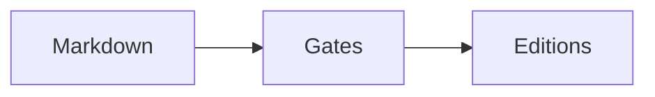

# Cross-references

## What works: links between documents

Write an ordinary markdown link to the source file:

```markdown
See the source review in [Annex Section 2](./GAPS_AND_SOURCES_ANNEX.md).
```

When that annex is embedded, **every `./FILE.md` target is rewritten to an
in-document anchor**, so the same markdown stays navigable in a repo and
resolves inside a single self-contained HTML file. `verify` fails on any
`href="#…"` with no matching id, so a rewrite that misses is a build failure,
not a dead link in a published document.

Link *targets* of `./NAME.md` are fine. A link *label* showing a filename is a
lint block (`filename-label`): the reader should see "Annex Section 2", never
`GAPS_AND_SOURCES_ANNEX.md`.

## What works: referring to annex sections in prose

The profile supplies the phrase — `annex_reference` (`Annex Section`, *Phụ lục
Mục*) — and the annex numbers its own sections `1..N`. Write the reference in
that form and the contents entries line up with it.

## Anchors you control

```markdown
## Background {#context}
```

Fix an id when a reference must survive an edit to the heading text. Otherwise
the id is generated from the heading, with diacritics folded when the profile
allows.

## Numbered cross-references

Label a figure, table or equation with a caption line, then refer to it by id:

````markdown


: How a document reaches a reader {#fig-stages}

| Stage | Refuses on |
|:---|:---|
| lint | internal machinery |

: What each stage refuses {#tbl-gates}

$$
a^2 + b^2 = c^2
$$ {#eq-pythagoras}

The pipeline is drawn in @fig-stages and the gates are set out in @tbl-gates.
````

`@fig-stages` renders as the localised label and number — **Figure 1**, *Sơ đồ 1*,
**图 1** — in prose, in a table cell, in another caption. Reorder the figures and
the numbers follow; that is the whole point.

Ids are prefixed by kind: `fig-`, `tbl-`, `eq-`. An equation carries its
label on the closing `$$` fence rather than on a following line, because a
display block has no natural line after it. Figures and tables number
independently, and numbering restarts in the annex, which is what its label
says — *Figure A1* is the annex's first, not the document's fourteenth.

A label is **optional**. An unlabelled figure keeps the positional caption it
has always had, so nothing already written needs changing.

## Numbering happens once, not four times

Four emitters render the same source, and each could number its own figures.
Each would be right on its own — and that is exactly how this pipeline's
editions have disagreed before, every time an emitter was added. So the
numbering is resolved once, in `xref.py`, and every emitter is handed text that
is already resolved. An emitter that counts is an emitter that will eventually
count differently.

## Two ways it can go wrong, both blocked

| Rule | Catches |
|---|---|
| `dangling-reference` | `@fig-absent` — a reference to a label that does not exist |
| `duplicate-label` | the same id declared twice |

Neither is visible in the output. An unresolved reference prints as its own
source — *"see @fig-density"* — and a repeated label makes every reference to it
silently mean the first. Both are the sort of thing a reader finds and an author
does not, so lint blocks them.

## Related

`structure.md` · `diagrams.md` · `unsupported-syntax.md` · `lint.md`
