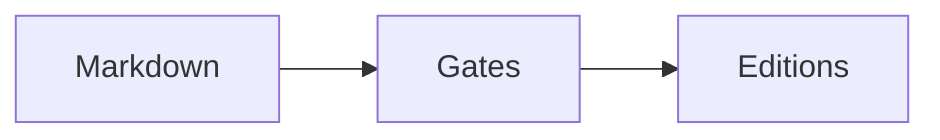

# Cross-references

## What works: links between documents

Write an ordinary markdown link to the source file:

```markdown
See the source review in [Annex Section 2](./GAPS_AND_SOURCES_ANNEX.md).
```

When that annex is embedded, **every `./FILE.md` target is rewritten to an
in-document anchor**, so the same markdown stays navigable in a repo and
resolves inside a single self-contained HTML file. `verify` fails on any
`href="#…"` with no matching id, so a rewrite that misses is a build failure,
not a dead link in a published document.

Link *targets* of `./NAME.md` are fine. A link *label* showing a filename is a
lint block (`filename-label`): the reader should see "Annex Section 2", never
`GAPS_AND_SOURCES_ANNEX.md`.

## What works: referring to annex sections in prose

The profile supplies the phrase — `annex_reference` (`Annex Section`, *Phụ lục
Mục*) — and the annex numbers its own sections `1..N`. Write the reference in
that form and the contents entries line up with it.

## Anchors you control

```markdown
## Background {#context}
```

Fix an id when a reference must survive an edit to the heading text. Otherwise
the id is generated from the heading, with diacritics folded when the profile
allows.

An id beginning `sec-` does more than anchor: it registers the heading as a
**referable section**, so `@sec-` resolves in prose the way `@fig-` does.

```markdown
## Background {#sec-context}

The scope is set out in @sec-context.
```

A section reference renders as **the heading's own words** — "set out in
Background" — not as a number. Nothing here numbers headings, and four emitters
agreeing on a heading counter is the failure the section below describes; the
heading text is also what a reader can actually find on the page.

The attribute carries both marks in either order: `## Background {.part #sec-context}`.

## Numbered cross-references

Label a figure, table or equation with a caption line, then refer to it by id:

````markdown


: How a document reaches a reader {#fig-stages}

| Stage | Refuses on |
|:---|:---|
| lint | internal machinery |

: What each stage refuses {#tbl-gates}

$$
a^2 + b^2 = c^2
$$ {#eq-pythagoras}

The pipeline is drawn in @fig-stages and the gates are set out in @tbl-gates.
````

`@fig-stages` renders as the localised label and number — **Figure 1**, *Sơ đồ 1*,
**图 1** — in prose, in a table cell, in another caption. Reorder the figures and
the numbers follow; that is the whole point.

Ids are prefixed by kind: `fig-`, `tbl-`, `eq-` and `sec-`. The first three are
numbered and take their label from the profile; a section is not numbered and
reads as its own heading. An equation carries its
label on the closing `$$` fence rather than on a following line, because a
display block has no natural line after it. Figures and tables number
independently, and numbering restarts in the annex, which is what its label
says — *Figure A1* is the annex's first, not the document's fourteenth.

A label is **optional**. An unlabelled figure keeps the positional caption it
has always had, so nothing already written needs changing.

An image is labelled the same way — the caption goes on the line under it, not
in the ``. See `images.md`, including what happens to a caption
written under something that carries none.

### `fig-` is not `figures.toml`

The word carries both of its ordinary meanings in this pipeline, in the places
each is ordinary, and they are unrelated:

| | Means | Lives in |
|---|---|---|
| `{#fig-density}`, `@fig-density` | a **figure as an illustration** — a diagram, chart or image with a caption | the markdown |
| `figures.toml`, `paperforge figures` | a **figure as a number** — "the latest figures" — that every document must state the same way | the project manifest |

Labelling a chart `{#fig-density}` says nothing to the figures gate, and
declaring a canonical value in `figures.toml` numbers no illustration. See
`figures.md`, which opens by making the same distinction from the other side.

## Labelling a claim, which is not a cross-reference

A paragraph can carry an id at its end:

```markdown
The estimator is consistent under A1-A3. {#claim-consistency}
```

This is the one labelled thing with **no rendered form**. It takes no number,
`@claim-consistency` is not part of the reference syntax, and lint blocks it in
prose (`claim-reference`) — because there is nothing on the page for such a
reference to resolve to. A claim exists so the document can be mapped, not so
it can be named in a sentence; to point a reader at one, refer to its section.

The label is stripped from every edition. A paragraph that merely ends in
braces — `the set {a, b}.` — is left alone: only an attribute that actually
carries a `claim-` id is taken.

An id declared twice is blocked, the same as any other label.

## Numbering happens once, not four times

Four emitters render the same source, and each could number its own figures.
Each would be right on its own — and that is exactly how this pipeline's
editions have disagreed before, every time an emitter was added. So the
numbering is resolved once, in `xref.py`, and every emitter is handed text that
is already resolved. An emitter that counts is an emitter that will eventually
count differently.

## Two ways it can go wrong, both blocked

| Rule | Catches |
|---|---|
| `dangling-reference` | `@fig-absent`, `@sec-absent` — a reference to a label that does not exist |
| `duplicate-label` | the same id declared twice |

Neither is visible in the output. An unresolved reference prints as its own
source — *"see @fig-density"* — and a repeated label makes every reference to it
silently mean the first. Both are the sort of thing a reader finds and an author
does not, so lint blocks them.

## The other direction: nothing pointing at a label

`dangling-reference` catches a reference to a label that is not there.
`orphan-label` catches the mirror — a figure, table or equation that is
declared, correctly numbered, printed, and never mentioned in the prose. It is
just as invisible: the float looks deliberate on the page.

This **warns** rather than blocks. An annex table no body paragraph discusses is
legitimate, and a reference from anywhere in the work — body or annex — counts.

A **section** label is exempt. A heading is labelled to give it a stable anchor
at least as often as to be referred to, so an unreferenced `{#sec-…}` is not a
finding.

`empty-section` is the same idea for headings: one with no prose and no heading
beneath it. A part banner is not empty — what follows it is the headings it
opens.

## Related

`claims.md` · `figures.md` · `structure.md` · `diagrams.md` · `unsupported-syntax.md` · `lint.md`
