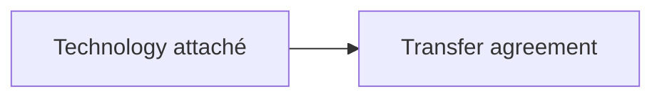

# Diagrams

A fenced `mermaid` block becomes a numbered figure. Nothing else in a fenced
block is rendered — any other language is set as a code sample.

````markdown

````

## Captions

Without a caption line the caption is the profile's `figure` label with the
figure's position: `Figure 1`, `Sơ đồ 1`. Inside an annex it uses
`annex_figure` — `Figure A1`.

To write the caption yourself, and to be able to refer to the figure by number,
put a caption line after the block:

```markdown
: Robot density by country, 2025 {#fig-density}
```

which renders as *Figure 3. Robot density by country, 2025* and makes
`@fig-density` resolve to **Figure 3** anywhere in the document. See
`cross-references.md`.

## Rendering

Diagrams are **pre-rendered at build time** to inline SVG. Nothing is fetched
when the document is opened, so it works offline, and this avoids a real defect:
with `startOnLoad` the library reused one SVG id across diagrams and emitted
several without a `viewBox`, drawing them on top of each other.

For the print edition the same diagrams are **rasterised through Chrome at 3×**
rather than embedded as SVG. Mermaid puts every node label inside
`<foreignObject>`, which Typst does not draw: embedding the SVG directly
produced boxes and arrows with no text at all.

## Colour

A diagram is drawn in the document's palette. Mermaid names its theme in its own
vocabulary, so the mapping is written down once in `palette.MERMAID`: a node
takes `navy-soft`, its border and every connector `navy-3`, labels and titles
`navy`, clusters `line-soft` inside `line`, and a categorical scale runs navy,
navy-3, amber. The font stack comes from the palette too.

A node fill is `navy-soft` rather than `navy` because a flowchart node filled
with a structural colour at full strength has unreadable text on it.

> This was a module constant carrying twelve colours of its own — a third
> palette, near enough the document's to look deliberate and far enough to be
> visible beside it. `#0b2545` and `#1c4a80` are not navy tokens. A project that
> declared a full brand got a branded cover, branded parts, branded tables and
> Paperforge-blue flowcharts between them.

**The cache keys on the palette as well as the sources.** It keyed on the
sources alone, so changing a palette and rebuilding served the diagrams back in
the old colours — on a machine where everything else had changed, with the build
reporting success. A cache written before this carries no theme, compares
unequal, and re-renders.

The raster for the print edition has a **transparent** background rather than a
white one. White is a colour chosen where it is written: correct on white paper
and a white rectangle on any other.

## Sizing

A wide diagram is never shrunk below ~70% of its natural width — it scrolls
horizontally instead of turning illegible. In print it scales to fit, capped at
**198mm tall**: A4 leaves ~249mm of printable height, and a diagram taller than
the page cannot honour `break-inside: avoid`, so it splits and strands an empty
frame on the page before. Three of ten diagrams in one report printed at
255–334mm before the cap.

Deck diagrams are capped at 470px so they fill a slide.

## Related

`figures.md` (the numeric-consistency gate — a different thing) ·
`unsupported-syntax.md` · `print.md` · `decks.md`
