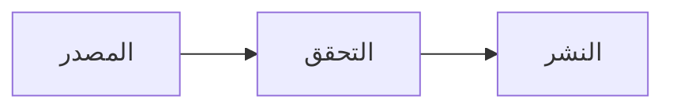

# وثيقة
## تقرير بحثي

---
**الجهة المعدة:** معهد
**تاريخ الإنجاز:** 08/2026

---

## المحتويات

1. **الملخص التنفيذي**
2. **السياق**
3. **النتائج**
4. **الخاتمة**

---

## الملخص التنفيذي {.part}

استبدل هذه الفقرة بمضمون القسم.

استبدل هذه الفقرة بمضمون القسم.

## السياق {.part}

استبدل هذه الفقرة بمضمون القسم.

استبدل هذه الفقرة بمضمون القسم.

## النتائج {.part}

: مسار الوثيقة من المصدر إلى القارئ {#fig-masar}

يوضح @fig-masar المسار كاملاً.

استبدل هذه الفقرة بمضمون القسم.

استبدل هذه الفقرة بمضمون القسم.

## الخاتمة {.part}

استبدل هذه الفقرة بمضمون القسم.

استبدل هذه الفقرة بمضمون القسم.
