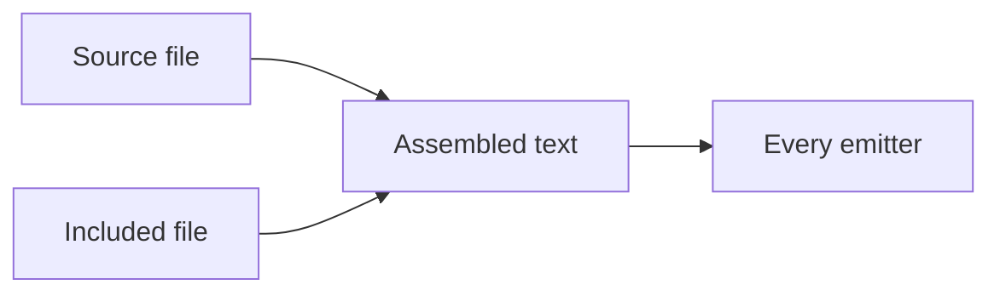

## Findings from a separate file {.part}

This chapter lives in its own file. Cross-references still resolve across the
whole work: the pipeline is drawn in @fig-pipeline, above, in the source file.

The point of splitting a document is that a two-hundred page thesis in one
markdown file is neither editable by a human nor reviewable in a diff.

A diagram declared here, not in the source file. Nothing rendered it until the
diagram pass was moved onto `assemble.sources()`: the emitters read the
assembled text, allocated this figure a number, and pointed at a raster that had
never been asked for. The reading edition drew an empty frame and only Typst
failed out loud.

: A figure that only exists in an included file {#fig-assembled}

@fig-assembled numbers after @fig-pipeline, because the pieces are concatenated
before anything counts them.
