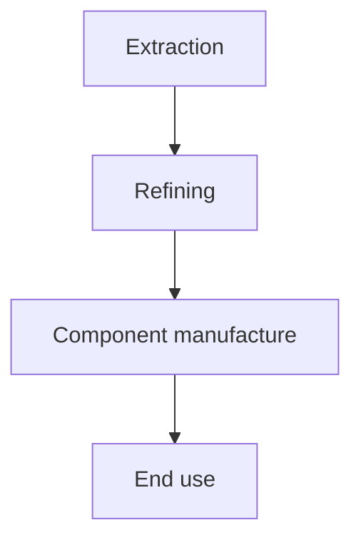

# RESEARCH REPORT
## CRITICAL MINERALS SUPPLY CHAINS: A WORKED EXAMPLE FOR THE PIPELINE

---
**Prepared by:** Paperforge Research
**Audience:** Pipeline test fixture
**Completed:** August 2026

---

## CONTENTS

1. **EXECUTIVE SUMMARY**
2. **PART I: CONTEXT**
   - 1.1. Global demand
   - 1.2. Processing bottlenecks
3. **PART II: FINDINGS**
   - 2.1. Concentration risk
4. **CONCLUSION**
5. **[ANNEX: SOURCES AND METHOD](./annex.md)**
   - Section 1. Source appraisal
   - Section 2. Baselines

---

## 1. EXECUTIVE SUMMARY

Refining capacity, not extraction, is the binding constraint. Baseline figures and
their provenance are set out in *Annex Section 2*.

---

## PART I: CONTEXT

### 1.1. Global demand

Demand grows with electrification. The table below is deliberately wide enough to
exercise the horizontal-scroll affordance on a phone.

| Mineral | Primary use | Leading producer | Refining share | Substitution risk |
|:---|:---|:---|:---:|:---|
| Lithium | Batteries | Australia | Concentrated | Low in the near term |
| Cobalt | Batteries | DRC | Concentrated | Moderate |
| Rare earths | Magnets | China | Highly concentrated | Low |

### 1.2. Processing bottlenecks

Midstream refining is the choke point; see *Annex Section 1* for how each claim was
appraised.

---

## PART II: FINDINGS

### 2.1. Concentration risk

A single jurisdiction refines the majority of several critical inputs.

---

## PART III: CONCLUSION

Policy attention should follow the midstream rather than the mine./.
