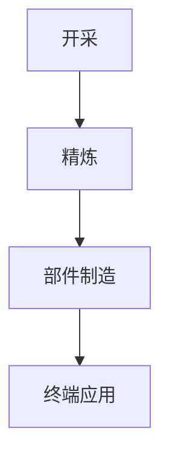

# 研究报告
## 关键矿产供应链：管线的中文示例

---
**编制单位：** Paperforge 研究团队
**用途：** 管线测试样本
**完成时间：** 2026年8月

---

## 目录

1. **执行摘要**
2. **第一部分：背景**
   - 1.1. 全球需求
   - 1.2. 加工瓶颈
3. **第二部分：研究发现**
4. **结论**
5. **[附件：来源与方法](./annex.md)**
   - 第1节 来源评估
   - 第2节 基准数据

---

## 执行摘要

制约因素在于精炼产能而非开采能力。全球已探明储量足以支撑未来十年的需求增长，真正的瓶颈出现在中游的分离与精炼环节。该环节资本密集、审批周期长，且高度集中于少数司法管辖区，因此产能扩张的速度远慢于下游需求。基准数据及其来源载于附件，评估方法见附件第1节。

---

## 第一部分：背景

### 1.1. 全球需求

需求随电气化而增长。动力电池、永磁电机与电网储能构成三大增量来源，其中动力电池在可预见的时间内仍占主导地位。需要注意的是，各类矿产的需求曲线并不同步：锂与钴的增长与整车产量直接相关，而稀土的需求则更多取决于电机设计路线的选择。下表刻意做得较宽，以便检验手机上的横向滚动提示。

| 矿产 | 主要用途 | 主要生产国 | 精炼集中度 | 替代风险 |
|:---|:---|:---|:---:|:---|
| 锂 | 电池 | 澳大利亚 | 高度集中 | 近期较低 |
| 钴 | 电池 | 刚果（金） | 高度集中 | 中等 |
| 稀土 | 永磁体 | 中国 | 极高 | 较低 |

### 1.2. 加工瓶颈

中游精炼是关键瓶颈。新建一座符合环保标准的分离工厂通常需要五到七年，其中环境评估与试生产阶段占去大半时间，这一周期明显长于矿山扩产所需的时间。因此，即便上游产能在短期内增加，中游环节仍会限制可交付的产量。评估方法见附件第1节。

---

## 第二部分：研究发现

单一司法管辖区精炼了多种关键投入品的大部分产量，其中稀土永磁材料的集中度最高。这种集中并非源于资源禀赋，而是长期产业政策、配套化工能力与环境成本内部化程度差异共同作用的结果。对进口方而言，风险因此并不表现为价格波动，而是表现为在特定时点无法获得符合规格的材料。

---

## 结论

政策关注点应从矿山转向中游环节。仅保障原料来源而不同时建立分离与精炼能力，并不能降低供应中断的风险。可行的路径包括：与具备化工基础的伙伴共建产能、将回收料纳入统一的规格与认证体系，以及在采购合同中明确交付规格而非仅规定数量。
