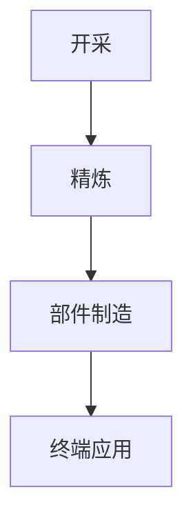

# 研究报告
## 关键矿产供应链：管线的中文示例

---
**编制单位：** Paperforge 研究团队
**用途：** 管线测试样本
**完成时间：** 2026年8月

---

## 目录

1. **执行摘要**
2. **第一部分：背景**
   - 1.1. 全球需求
   - 1.2. 加工瓶颈
3. **第二部分：研究发现**
4. **结论**
5. **[附件：来源与方法](./annex.md)**
   - 第1节 来源评估
   - 第2节 基准数据

---

## 执行摘要

制约因素在于精炼产能而非开采能力。基准数据及其来源载于附件。

---

## 第一部分：背景

### 1.1. 全球需求

需求随电气化而增长。下表刻意做得较宽，以便检验手机上的横向滚动提示。

| 矿产 | 主要用途 | 主要生产国 | 精炼集中度 | 替代风险 |
|:---|:---|:---|:---:|:---|
| 锂 | 电池 | 澳大利亚 | 高度集中 | 近期较低 |
| 钴 | 电池 | 刚果（金） | 高度集中 | 中等 |
| 稀土 | 永磁体 | 中国 | 极高 | 较低 |

### 1.2. 加工瓶颈

中游精炼是关键瓶颈，评估方法见附件第1节。

---

## 第二部分：研究发现

单一司法管辖区精炼了多种关键投入品的大部分产量。

---

## 结论

政策关注点应从矿山转向中游环节。
